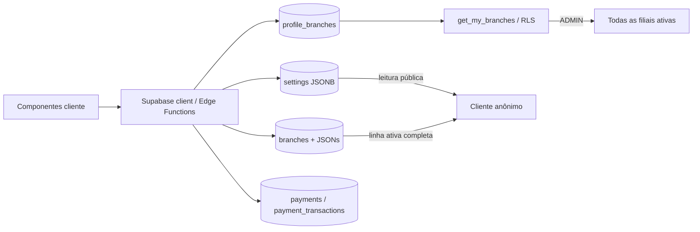
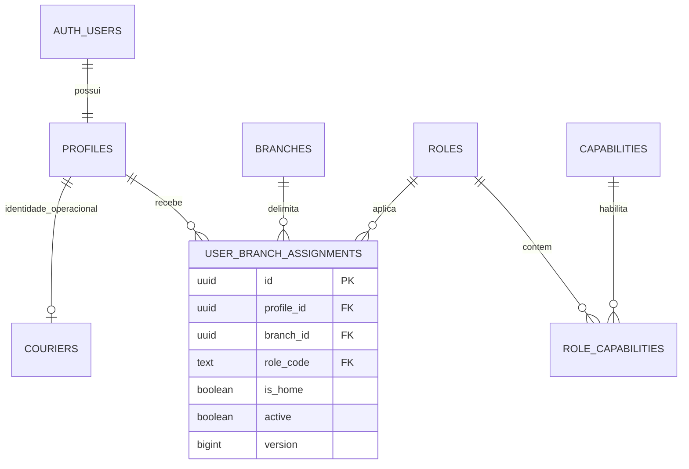
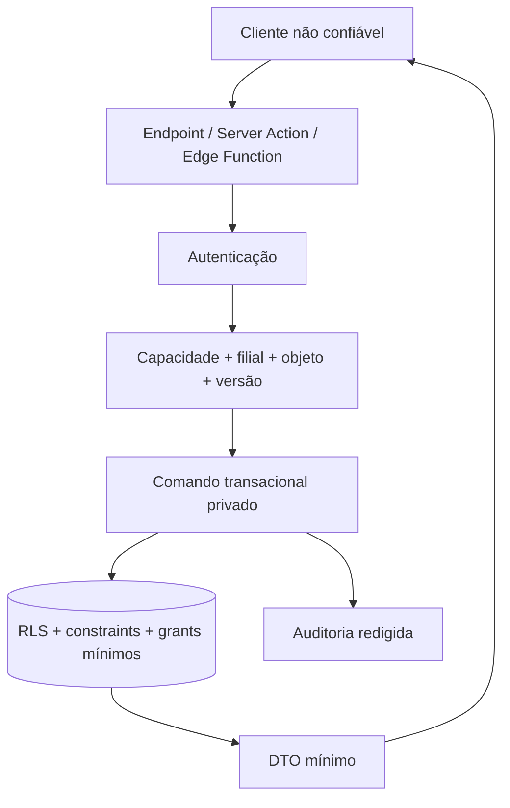

# Estudo de arquitetura — usuários, filiais, configurações e taxas de pagamento

**Data:** 8 de setembro de 2026  
**Branch:** `codex/estudo-configuracoes-filiais`  
**Natureza:** auditoria, decisão arquitetural e primeira implementação incremental (ainda não aplicada em produção)  
**Prompt aplicado:** [`prompt-auditoria-configuracoes-usuarios-filiais.md`](./prompt-auditoria-configuracoes-usuarios-filiais.md)

## 1. Resumo executivo

O sistema já tem uma base multi-filial relevante, mas o modelo de segurança e o modelo de configuração ainda não são coerentes entre si. A tabela `profile_branches` permite o vínculo N:N necessário ao atendente, porém o papel `ADMIN` continua global em diversas políticas, funções e telas. Isso impede cumprir com segurança a regra de “administrador de uma única filial”. O entregador tem restrição de uma filial no fluxo de criação, mas não recebe a mesma garantia na edição nem uma atualização atômica entre `profiles`, `profile_branches` e `couriers`.

As configurações estão divididas entre uma tabela global genérica (`settings`), colunas em `branches` e objetos JSON. Cada domínio implementa herança de um jeito. Há valores em que `0` significa simultaneamente “usar o padrão” e um valor comercial válido. Também foi encontrada divergência entre `packaging_fee` e `packing_fee`. A interface global é um componente cliente grande e o usuário pode estar com uma filial selecionada enquanto edita “configurações globais”, aumentando o risco de erro de escopo.

O maior risco imediato é de segurança: permanecem políticas RLS de leitura pública para todas as linhas de `settings` e para a linha completa de cada filial ativa. Como não há revogação explícita dos privilégios de leitura nessas migrações, uma instalação com os privilégios padrão do Supabase pode expor dados internos como IP/porta de impressão, templates, metas e futuras configurações financeiras. O checkout público já dispõe de funções próprias, portanto deve receber apenas DTOs permitidos por esses endpoints.

Não existe hoje um modelo de custo de cartão por filial. `payment_method_configs` é global, e `payments`/`payment_transactions` não guardam taxa, custo líquido ou conciliação. Consequentemente, os relatórios de margem consideram recebimento menos custo dos produtos, mas não o custo da adquirente. Para garantir valores corretos, a taxa precisa ser uma regra versionada e com vigência, e cada pagamento deve registrar um snapshot imutável da regra aplicada.

### Recomendação principal

Adotar quatro papéis lógicos e capacidades verificadas no servidor e no banco. Para preservar compatibilidade nesta primeira entrega, o papel global é representado por `role = ADMIN` + `profiles.is_global_admin = true`; `ADMIN` sem essa marca é administrador de filial:

- `OWNER` lógico / administrador global: escopo da rede, reservado a pouquíssimas pessoas;
- `BRANCH_ADMIN`: exatamente uma filial;
- `ATTENDANT`: uma ou mais filiais;
- `COURIER`: exatamente uma filial.

Em paralelo, substituir a edição fragmentada por uma Central de Configurações com escopo explícito (`Rede` ou `Filial`), valor efetivo e origem visíveis, alterações atômicas e versionadas. Configurações críticas — especialmente taxas — devem ter tabelas tipadas, não uma chave JSON genérica.

### Estado da implementação nesta branch

- `emanuel-morais@outlook.com` é promovido de forma idempotente a administrador global, inclusive se o perfil for criado depois da migration;
- administradores de filial e entregadores passam a ter exatamente uma filial; atendentes, uma ou mais, com filial inicial explícita;
- gestão de usuário passa por comando SQL transacional e revalida ator, alvo e escopo mesmo usando `service_role`;
- políticas públicas amplas de `settings`/`branches` foram removidas e o cardápio público recebe allowlist sem `cost_price`;
- foi criada a Central de Configurações, com Usuários, Filiais, Pagamentos/Taxas e Geral, além de navegação móvel limitada a cinco itens;
- taxas de cartão por filial agora têm vigência, faixa de parcelas, adquirente, taxa percentual/fixa, antecipação, prazo, versão, auditoria e snapshot no pagamento;
- taxas podem ter fallback ou override por tipo e origem do pedido, permitindo separar `VIAGEM + ATTENDANT` (maquininha do atendente) de app, QR Code e WhatsApp;
- WhatsApp e as vias de cozinha, produção e cliente agora podem ser habilitados por filial, tipo e origem do pedido, com decisão autoritativa baseada no pedido persistido;
- relatórios, confirmação/adição/reimpressão de pedidos, revogação de fidelidade e consulta interna de clientes foram limitados às filiais autorizadas antes de qualquer escrita privilegiada;
- as policies autenticadas de cardápio, zonas de entrega, clientes, endereços e fidelidade foram separadas das policies anônimas e limitadas às filiais autorizadas, evitando a composição permissiva por `OR`;
- a Central ganhou histórico visual filtrável por área e filial, com payload deliberadamente restrito a metadados para não transportar valores sensíveis ao navegador;
- foi adicionada uma suíte pgTAP para invariantes de vínculo, isolamento da auditoria e regras financeiras; sua execução depende do stack local do Supabase/Docker;
- conciliação automática com extrato da adquirente, capacidades granulares, diff redigido e restauração assistida permanecem como próximos incrementos.

## 2. Escopo e método

Foram analisados:

- documentação existente e instruções do repositório;
- componentes e rotas de usuários, filiais e configurações;
- contextos de autenticação e filial;
- APIs cliente e Edge Function `manage-users`;
- schema, migrações, RLS, funções privilegiadas e auditoria;
- fluxos de pagamento e relatórios financeiros;
- estrutura mobile-first por inspeção de código;
- documentação instalada do Next.js usado pelo projeto;
- documentação oficial de Supabase, Toast, Square, Mercado Pago, Stripe, OWASP e WCAG.

O grafo local do repositório foi atualizado e resultou em 2.454 nós, 4.072 relações e 145 comunidades, apoiando o rastreamento entre UI, APIs e banco.

### Limitação da validação visual

O servidor de desenvolvimento iniciou, mas a navegação parou no `proxy.ts` porque as variáveis públicas do Supabase não estão disponíveis no ambiente desta análise. Portanto, os achados de interface móvel foram verificados estaticamente, e uma rodada visual em 360, 390, 768 e 1280 px permanece obrigatória antes da implementação ser aceita.

Também há divergência documental: o `README.md` cita Next.js 15, o `package.json` declara `^16.3.1` e o runtime local iniciou como 16.2.4. O lockfile e a documentação devem ser atualizados em conjunto antes de qualquer alteração estrutural.

## 3. Mapa do estado atual

| Área | Implementação atual | Consequência |
|---|---|---|
| Identidade | Supabase Auth + `profiles` | Base adequada, mas o papel global está misturado ao escopo de filial |
| Papéis | `ADMIN`, `ATTENDANT`, `COURIER` | Não existe proprietário da rede separado do administrador local |
| Vínculo | `profile_branches` N:N + `home_branch_id` | Atendente já pode ter várias filiais; `home_branch_id` é preenchida com o primeiro item, não uma decisão explícita |
| Administrador | `get_my_branches()` devolve todas as filiais ativas | Todo administrador é, na prática, administrador da rede |
| Entregador | `profiles` + `profile_branches` + `couriers.profile_id` | Há duas representações que podem ficar divergentes em uma edição/troca de papel |
| Configuração global | `settings(key, value jsonb)` | Flexível, porém sem contrato de tipo, agrupamento, versão ou separação pública/privada |
| Configuração de filial | Colunas em `branches` + JSONs | Herança varia conforme o campo e a lógica está duplicada |
| Pagamentos | `payment_method_configs`, `payments`, `payment_transactions` | Sem custo de processamento, líquido, regra aplicada ou conciliação |
| Auditoria | triggers em `branches` e `settings` + logs de usuário | Existe evidência básica, mas sem lote, motivo, versão, aprovação ou restauração |
| Autorização web | menu/layout clientes + autenticação no Proxy | Esconde interface, mas não constitui barreira de autorização |
| Autorização de dados | RLS + Edge Functions com `service_role` | As RLS melhoraram, mas o serviço privilegiado precisa reproduzir todo o escopo manualmente |

Fluxo atual simplificado:



## 4. Achados priorizados

As referências de arquivo e linha desta seção registram o estado da branch base no momento da auditoria; parte delas foi corrigida pela implementação descrita no resumo e, por isso, pode ter mudado de caminho ou posição no diff atual.

### P0 — corrigir antes da remodelagem visual

#### P0.1 — `ADMIN` é global e não pode ser limitado a uma filial

**Evidências**

- `supabase/migrations/20260515230000_multi_branch_schema.sql:70` declara que ADMIN acessa todas as filiais mesmo sem vínculo.
- `supabase/migrations/20260515230000_multi_branch_schema.sql:115` implementa `get_my_branches()` e `:120` retorna toda filial ativa quando o papel é ADMIN.
- `src/app/app/usuarios/components/UserFormSheet.tsx:227` informa na própria interface que a seleção de filial é ignorada para ADMIN.
- `supabase/functions/manage-users/index.ts:60` exige somente `role = ADMIN`; não testa a filial administrada nem uma capacidade específica.

**Impacto**

Um administrador de uma unidade pode listar e modificar usuários, configurações e dados operacionais de toda a rede. Vincular um ADMIN a uma filial apenas na interface não resolveria, pois banco e Edge Functions continuariam globais.

**Correção-alvo**

Separar `OWNER` de `BRANCH_ADMIN`, tornar a filial obrigatória para o segundo e substituir comparações diretas de papel por checagens de capacidade + escopo.

#### P0.2 — leitura pública ampla de configurações e filiais

**Evidências**

- `supabase/migrations/20260511030000_global_settings_app_source.sql:5-8` recria `Public read settings` com `USING (true)`.
- `supabase/migrations/20260515230000_multi_branch_schema.sql:139-140` permite SELECT público da linha completa de toda filial ativa.
- Não foi encontrada migração posterior removendo essas políticas ou revogando SELECT de `anon` nessas tabelas.
- `branches` guarda `printer_config`, templates, meta mensal e demais dados internos; `settings` inclui host/porta de impressão e configurações de integração.

**Impacto**

RLS limita linhas, não colunas. Se `anon` mantém o privilégio SELECT padrão, a API pode devolver todos os campos dessas linhas. O problema tende a crescer quando taxas e segredos operacionais forem adicionados.

**Correção-alvo**

- revogar acesso direto de `anon` e `authenticated` que não seja necessário;
- remover as políticas públicas amplas;
- expor checkout somente por RPC/Edge Function com DTO allowlist;
- criar uma visão pública mínima apenas se houver necessidade comprovada;
- testar o papel `anon` tentando ler cada coluna sensível.

#### P0.3 — atualização de usuário não é atômica nem valida invariantes

**Evidências**

- `supabase/functions/manage-users/index.ts:214-235` atualiza o perfil, apaga vínculos e reinsere filiais em etapas separadas.
- O fluxo de update não normaliza papel/IDs, não confirma filial ativa e não exige cardinalidade por papel.
- `src/app/app/usuarios/components/UserFormSheet.tsx:108` valida uma filial para COURIER somente na criação.
- A criação insere `couriers` para COURIER (`manage-users/index.ts:186`), mas a atualização não sincroniza cadastro operacional, telefone e troca de papel.

**Impacto**

Falha intermediária pode deixar usuário sem filial; troca de papel pode deixar ou perder indevidamente registro de entregador; payload direto pode contornar as validações da tela.

**Correção-alvo**

Executar uma única função transacional no PostgreSQL, chamada por uma camada servidor, com validações e bloqueios apropriados. Operações administrativas com `service_role` devem fazer sua própria autorização de objeto antes de qualquer mutação.

#### P0.4 — taxas de cartão não existem como dado financeiro auditável

**Evidências**

- `payment_method_configs` é global e não possui `branch_id`, percentual ou vigência (`20260511000000_public_checkout_mercado_pago.sql:8`).
- `payment_transactions` registra valor e estado do provedor, mas não taxa, líquido ou liquidação (`:24`).
- o relatório define margem bruta como recebido menos COGS (`src/app/app/caixa/relatorio/page.tsx:1682`), sem custo da adquirente.

**Impacto**

Não é possível afirmar o valor líquido por venda/filial, conferir contrato versus cobrança real ou preservar histórico quando a taxa muda.

### P1 — corrigir na primeira fase funcional

#### P1.1 — herança ambígua e lógica duplicada

- horários nulos significam herdar;
- chave ausente em JSON de impressão/WhatsApp significa herdar;
- `packing_fee = 0` é tratado em partes do código como herança, embora zero seja um valor válido;
- flags globais e locais usam combinações diferentes;
- cliente e funções de backend calculam valores efetivos separadamente.

Um mesmo conceito deve usar o mesmo estado: `INHERIT`, `OVERRIDE` ou, somente quando suportado, `DISABLED`. O valor efetivo deve ser calculado em uma fonte autoritativa compartilhada.

#### P1.2 — divergência `packaging_fee` × `packing_fee`

- a configuração global usa `packaging_fee` (`global_settings_app_source.sql:21`);
- a filial usa `packing_fee` (`multi_branch_schema.sql:40`);
- o backfill procura `settings.key = 'packing_fee'` (`multi_branch_backfill.sql:16`).

O backfill provavelmente não encontrou o valor global sem uma chave legada de mesmo nome. A nomenclatura deve ser normalizada e a migração precisa verificar dados reais antes de corrigir.

#### P1.3 — `home_branch_id` não representa escolha explícita

`src/app/app/usuarios/page.tsx:105-113` usa sempre o primeiro `branch_id`. Reordenar uma lista pode mudar a filial inicial do atendente. A filial principal deve ser escolhida explicitamente e validada como parte do conjunto autorizado.

#### P1.4 — o navegador acessa e grava configuração crítica diretamente

`src/lib/api/settings-api.ts:41-50` faz upsert de todas as chaves. A página converte texto com `parseInt`/`parseFloat` (`configuracoes/page.tsx:183-193`) sem um schema de domínio no servidor. A RLS é necessária, mas insuficiente para consistência financeira e validação contextual.

#### P1.5 — proteção de rota é predominantemente cliente

O menu filtra itens por `role` e o layout cliente redireciona usuários. O Proxy autentica a sessão, mas não deve ser usado como autorização definitiva. Conforme a documentação do Next.js instalada, cada entrada de mutação e leitura sensível precisa checar autorização junto à fonte de dados e retornar DTO mínimo.

#### P1.6 — auditoria não forma uma alteração de configuração coerente

Os triggers registram imagens completas antes/depois, mas várias chaves salvas juntas geram eventos desconectados. Não há `change_set_id`, motivo, versão esperada, aprovação nem uma operação de restauração segura.

### P2 — qualidade, manutenção e experiência

- `configuracoes/page.tsx` concentra aproximadamente 887 linhas e quatro domínios em um componente cliente.
- a página recarrega configurações, estatísticas e todas as filiais a cada 15 segundos, mesmo durante edição.
- criar uma filial pode persistir um rascunho antes do término do fluxo.
- a tela exibe a filial atual no cabeçalho e, ao mesmo tempo, “Configurações globais”, sem um seletor de escopo inequívoco.
- a navegação inferior pode apresentar sete itens para ADMIN, comprimindo rótulos em 360 px.
- existem botões de ação de 32×32 px (`usuarios/page.tsx:389`), abaixo do alvo ampliado de 44×44 px recomendado para operação rápida.
- listas com link sobreposto e botões internos merecem revisão semântica e de área de toque.

## 5. Modelo-alvo de usuários e permissões

### 5.1 Matriz de papéis

| Papel | Filiais | Operação | Pessoas | Configuração | Financeiro |
|---|---:|---|---|---|---|
| `OWNER` | rede; sem vínculo obrigatório | todas | cria papéis dentro da própria capacidade | global e todas as filiais | vê custos/taxas de toda a rede |
| `BRANCH_ADMIN` | exatamente 1 | somente sua filial | gerencia atendentes/entregadores da própria filial | somente override da própria filial | vê e, se autorizado, edita taxas da filial |
| `ATTENDANT` | 1..N | filiais vinculadas | sem gestão por padrão | leitura efetiva necessária à operação | registra pagamentos, sem ver contrato de taxas por padrão |
| `COURIER` | exatamente 1 | entregas próprias da filial | nenhum | somente dados operacionais mínimos | vê valores necessários às próprias entregas |

Recomendação: a capacidade `MANAGE_PAYMENT_FEES` deve ser separada de `MANAGE_BRANCH_SETTINGS`. Um administrador operacional não necessariamente deve conhecer ou alterar custos de adquirência.

### 5.2 Invariantes

1. Usuário ativo, salvo `OWNER`, tem ao menos uma atribuição ativa.
2. `BRANCH_ADMIN` e `COURIER` têm exatamente uma filial.
3. `ATTENDANT` tem uma ou mais filiais.
4. `home_branch_id` pertence às atribuições ativas do usuário.
5. Gestor não concede papel/capacidade que não possui no mesmo escopo.
6. Gestor não altera as próprias permissões; outro `OWNER` precisa fazê-lo.
7. O último `OWNER` ativo não pode ser desativado, rebaixado ou excluído.
8. Filial desativada bloqueia novas operações, mas preserva histórico.
9. Desativar é o fluxo normal; exclusão física de identidade não é rotina.
10. Toda mutação inclui `expected_version` para impedir perda silenciosa por concorrência.

### 5.3 Estrutura sugerida

Uma evolução segura pode preservar `profiles`, mas deve tornar o escopo explícito:



Para `OWNER`, usar uma atribuição organizacional separada ou `organization_role` em `profiles`; não representar “todas as filiais atuais e futuras” com centenas de linhas implícitas. Para os demais papéis, o vínculo deve ser explícito.

### 5.4 Fluxo de gravação

1. cliente envia comando validado por schema;
2. camada servidor autentica e carrega o ator;
3. autorização checa capacidade, filial, alvo e versão;
4. função SQL privada valida invariantes e grava perfil, atribuições e entregador na mesma transação;
5. auditoria registra um único `change_set_id`, motivo e diff seguro;
6. resposta devolve DTO mínimo, nunca linhas completas por conveniência.

## 6. Arquitetura-alvo de configurações

### 6.1 Princípio de escopo

Cada campo deve apresentar três informações separadas:

- **padrão da rede**;
- **override da filial** (ausente ou explícito);
- **valor efetivo** e sua origem.

Exemplo:

```text
Taxa de embalagem
Valor efetivo: R$ 0,50  ·  Origem: padrão da rede
[Usar padrão da rede] [Personalizar nesta filial]
```

Nunca usar `0`, string vazia ou ausência de propriedade como convenções concorrentes para herança.

### 6.2 Armazenamento por domínio

Não é necessário eliminar todo JSON. A regra é:

- tabela/coluna tipada para configuração que afeta preço, autorização, conciliação, disponibilidade ou obrigação legal;
- JSON validado por schema para templates e detalhes evolutivos sem impacto financeiro direto;
- segredo somente em cofre/variável segura, com a configuração armazenando referência e estado, não o valor secreto;
- DTO público separado do modelo administrativo.

Domínios sugeridos:

| Domínio | Escopo | Armazenamento recomendado |
|---|---|---|
| Identidade da rede | global | `organizations` / `organization_settings` tipada |
| Identidade/endereço da filial | filial | `branches` |
| Horários e disponibilidade | global + filial | tabelas de agenda/override |
| Pedido e embalagem | global + filial | tabela tipada de política comercial |
| Entrega e zonas | filial | estrutura atual evoluída, com vigência quando necessário |
| Impressão | global + filial | perfil de impressão + setores; IP privado |
| WhatsApp | global + filial | política + templates; credencial no cofre |
| Pagamentos e taxas | filial | tabelas financeiras tipadas e versionadas |
| Segurança | global + filial | política e capacidades; edição restrita |

### 6.3 Serviço de configuração efetiva

Criar uma única fronteira servidor para:

- `getEffectiveConfig(branchId, domains, actor)`;
- `updateOrganizationConfig(command)`;
- `updateBranchOverrides(command)`;
- `validateConfig(scope)`;
- `previewConfigChange(command)`;
- `listConfigHistory(scope, domain)`.

O checkout recebe somente o subconjunto público. O PDV autenticado recebe apenas o necessário à operação. A tela administrativa recebe valor base, override, efetivo, versão e capacidade de edição.

### 6.4 Concorrência e auditoria

Toda raiz de configuração deve possuir `version bigint`. O comando envia `expected_version`; uma versão divergente retorna conflito com opção de recarregar/comparar. Alterações financeiras devem exigir `change_reason` e produzir:

- ator e escopo;
- data/hora;
- versão anterior/nova;
- diff redigido sem segredos;
- identificador do lote;
- origem (UI, migração, integração);
- correlação com publicação/rollback.

### 6.5 Matriz contextual de comunicação e impressão

Cada filial define filtros independentes para cada evento de WhatsApp e cada via de impressão. A chave de decisão é `filial + evento/setor + tipo do pedido + origem do pedido`.

- tipos: no local (`BALCAO`), viagem/retirada (`VIAGEM`) e entrega (`ENTREGA`);
- origens: atendente/maquininha, app/site, QR Code e WhatsApp;
- ausência dos novos filtros preserva o comportamento anterior e significa “todos”;
- listas explicitamente salvas precisam conter ao menos uma opção;
- o servidor relê tipo e origem do pedido no banco antes de decidir, evitando que o cliente falsifique o contexto;
- via do cliente, cozinha e sucos/batata são políticas separadas.

Exemplo recomendado: `order_received` e `order_out_for_delivery` habilitados para `ENTREGA`, comunicação desabilitada para `BALCAO`, e via do cliente habilitada para `VIAGEM` e `ENTREGA`. A escolha final continua por filial.

## 7. Modelo de taxas de crédito e débito

### 7.1 Conceitos que não podem ser misturados

1. **Custo da adquirente/MDR:** custo interno da loja.
2. **Custo de antecipação:** custo adicional por receber antes.
3. **Acréscimo ao cliente:** política comercial visível que altera o total pago.
4. **Taxa de entrega:** valor de logística, já existente.
5. **Taxa de embalagem:** valor comercial do pedido, já existente.

O campo “taxa” isolado seria ambíguo e perigoso.

### 7.2 Regra financeira proposta

Tabela `branch_payment_fee_rules`:

| Campo | Finalidade |
|---|---|
| `id`, `branch_id` | identidade e escopo obrigatório |
| `provider_code` | adquirente/provedor; inclusive `MANUAL` quando necessário |
| `channel` | `IN_PERSON`, `ONLINE` ou outro canal controlado |
| `payment_method` | `DEBIT_CARD` ou `CREDIT_CARD` |
| `card_brand` | bandeira específica ou `ANY` |
| `installments_from/to` | faixa de parcelas; débito exige 1/1 |
| `fee_percent` | percentual com precisão suficiente, por exemplo `numeric(9,6)` |
| `fee_fixed` | parcela fixa por transação, `numeric(12,2)` |
| `anticipation_percent` | custo de antecipação quando separado |
| `settlement_days` | prazo esperado de liquidação |
| `effective_from/to` | vigência temporal |
| `active`, `version` | ciclo de vida e concorrência |
| `created_by`, `updated_by`, timestamps | auditoria |

Restrições obrigatórias:

- percentuais entre 0 e 100;
- valor fixo não negativo;
- parcelas válidas e ordenadas;
- débito somente uma parcela;
- intervalo de vigência coerente;
- nenhuma sobreposição de regras ativas para a mesma chave de decisão;
- filial, provedor e método existentes/ativos;
- uma regra padrão inequívoca ou bloqueio da operação quando ausente, conforme decisão de negócio.

Para impedir sobreposição temporal com segurança, usar uma `EXCLUDE CONSTRAINT` PostgreSQL sobre filial, provedor, canal, método, bandeira, faixa de parcelas e intervalo de vigência, ou uma função transacional equivalente quando faixas multidimensionais exigirem regra mais específica.

### 7.3 Cálculo e arredondamento

Uma convenção inicial auditável:

```text
taxa_estimada = arredondar_centavos(valor_bruto × percentual / 100 + valor_fixo)
valor_liquido_estimado = valor_bruto − taxa_estimada − custo_antecipacao_estimado
```

O modo de arredondamento deve ser definido uma vez e testado contra os extratos do provedor. Não usar `number` JavaScript como fonte autoritativa de cálculo monetário; calcular com `numeric` no servidor e transportar centavos/strings decimais de forma controlada.

### 7.4 Snapshot por pagamento

No momento da autorização/confirmação, cada parcela de pagamento registra:

- `fee_rule_id`;
- `gross_amount`;
- `fee_percent_snapshot` e `fee_fixed_snapshot`;
- `estimated_fee_amount` e `estimated_net_amount`;
- `actual_fee_amount` e `actual_net_amount`, inicialmente nulos;
- `settlement_expected_at` e `settled_at`;
- identificadores do provedor;
- `reconciliation_status`: `PENDING`, `MATCHED`, `DIVERGENT`, `MANUAL_REVIEW`;
- payload bruto protegido/retido conforme política, nunca exposto ao cliente.

Alterar a regra futura não recalcula o histórico. Quando o extrato chegar, valores efetivos são conciliados sem apagar a estimativa original.

### 7.5 Simulador na interface

Para cada filial, o administrador autorizado deve poder simular, por exemplo, R$ 100,00:

```text
Crédito · Visa · 3x · Provedor X
Bruto                 R$ 100,00
Taxa contratada 3,49% -R$   3,49
Antecipação 0,00%     R$   0,00
Líquido estimado      R$  96,51
Recebimento previsto  30 dias
Vigência              01/09/2026 — sem término
```

A tela deve avisar sobre lacunas, conflitos, vigência expirada e divergência recorrente entre taxa estimada e cobrada.

### 7.6 Relatórios

Adicionar, sem renomear silenciosamente indicadores existentes:

- venda bruta;
- descontos comerciais;
- recebido bruto;
- custo de adquirência estimado/efetivo;
- líquido após adquirência;
- COGS;
- margem de contribuição após pagamento;
- valores a receber e liquidados;
- divergência de conciliação por filial/provedor.

“Margem bruta” existente pode continuar sendo recebimento menos COGS, mas deve ganhar definição visível; o novo indicador após taxa deve ter nome distinto.

## 8. Redesenho da experiência mobile-first

### 8.1 Nova arquitetura de informação

Entrada única: **Configurações**.

```text
┌──────────────────────────────────┐
│ Configurações                    │
│ [Rede ▾] ou [Filial: Águas ▾]    │  <- escopo sempre visível
│ [Pesquisar configuração...]      │
├──────────────────────────────────┤
│ Saúde da configuração       2 ⚠ │
│ • Taxa de crédito ausente        │
│ • Impressora sem resposta        │
├──────────────────────────────────┤
│ Geral                            │
│ Pedidos e horários               │
│ Pagamentos e taxas               │
│ Entrega                          │
│ Impressão                        │
│ WhatsApp                         │
│ Usuários e acessos               │
│ Segurança e histórico            │
└──────────────────────────────────┘
```

Na edição de uma filial:

- o escopo fica fixo no topo e não depende do seletor operacional do PDV;
- cada campo mostra `Herdado` ou `Personalizado`;
- “Restaurar padrão da rede” remove o override, não grava zero/string vazia;
- um painel “Revisar alterações” exibe o diff antes de publicar;
- o botão Salvar/Publicar fica fixo na parte inferior no celular;
- sair com alterações abre diálogo de descartar;
- erro de validação apresenta resumo com links para os campos;
- mudança global mostra quantas filiais serão afetadas.

### 8.2 Cadastro de usuário

Fluxo recomendado em uma única tela progressiva, não em abas que escondem erro:

1. identidade;
2. papel;
3. filial ou filiais conforme o papel;
4. filial principal apenas para atendente com múltiplas;
5. capacidades adicionais permitidas;
6. revisão clara do acesso resultante.

Exemplo de resumo:

```text
Maria — Atendente
Pode operar: Águas Claras, Feira
Filial inicial: Águas Claras
Não pode: editar taxas, gerenciar usuários, acessar outras filiais
```

Para entregador, telefone e filial pertencem ao mesmo comando de criação/edição. Para administrador, o seletor aceita uma única filial. Para proprietário, a interface explica o alcance global e exige confirmação reforçada.

### 8.3 Critérios de interação

- alvos de toque preferencialmente 44–48 px; nunca depender de ícone 32 px em fluxo frequente;
- controles essenciais acessíveis com uma mão e sem hover;
- teclado numérico/decimal adequado para valores;
- moeda formatada durante a digitação sem perder precisão;
- foco, rótulo, mensagem de erro e contraste conformes WCAG 2.2 AA;
- barra inferior com poucos destinos primários; itens administrativos ficam em “Mais”/painel administrativo;
- skeleton/erro/retry por seção, evitando bloquear toda a página;
- evitar polling que substitua estado enquanto o usuário edita; usar invalidação após comando ou atualização em tempo real controlada.

## 9. Segurança-alvo

### 9.1 Camadas



- **UI:** melhora compreensão, mas não concede segurança.
- **Proxy:** pode rejeitar sessão ausente de forma otimista; não substitui checagem perto do dado.
- **Servidor:** valida payload e autorização de cada recurso.
- **Banco:** RLS, constraints, grants e transações preservam invariantes.
- **`service_role`:** nunca é autorização; é apenas poder técnico. A função que a usa deve autenticar e autorizar explicitamente.

### 9.2 Ações concretas

1. mover funções `SECURITY DEFINER` administrativas para schema privado;
2. usar `search_path = ''` e nomes totalmente qualificados;
3. revogar `EXECUTE` de `PUBLIC`, `anon` e papéis não necessários;
4. conceder execução somente às rotas/papéis previstos;
5. substituir SELECT `*` por DTOs/colunas allowlist;
6. remover política pública de `settings` e leitura de linha completa de `branches`;
7. separar configuração pública da administrativa;
8. indexar colunas usadas em RLS, sobretudo `profile_id`, `branch_id`, `active` e chaves de relacionamento;
9. usar `(select auth.uid())` nas políticas quando adequado ao plano de consulta;
10. nunca usar `user_metadata` editável como fonte de autorização;
11. registrar tentativas negadas relevantes sem incluir tokens/segredos;
12. criar sessão curta/reautenticação para alterações de segurança e taxas, se o risco operacional justificar.

### 9.3 Matriz mínima de testes de autorização

Para cada operação, escrever ao menos um teste permitido e todos os principais negados:

| Caso | OWNER | Admin filial A | Atendente A+B | Entregador A | Anônimo |
|---|---:|---:|---:|---:|---:|
| Ler configuração interna A | sim | sim, por capacidade | somente efetiva mínima | não | não |
| Ler configuração interna B | sim | não | somente efetiva mínima se vinculado | não | não |
| Editar override A | sim | sim | não | não | não |
| Editar taxa A | sim | somente com capacidade | não | não | não |
| Gerenciar usuário da A | sim | sim, sem elevar acima de si | não | não | não |
| Vincular usuário à B | sim | não | não | não | não |
| Ler configuração pública do checkout A | sim | sim | sim | sim | somente DTO público |

Executar testes SQL com pgTAP, testes de Edge Functions e testes de integração usando tokens reais de cada perfil. Testar também política permissiva concorrente, pois políticas RLS são combinadas por OR e o repositório já precisou corrigir esse tipo de falha.

### 9.4 Funcionalidades importantes ainda pendentes

| Prioridade | Funcionalidade | Por que importa |
|---|---|---|
| P0 | Executar e ampliar a suíte pgTAP em CI | A matriz inicial foi criada; ainda é preciso executá-la no stack Supabase e cobrir todas as policies antigas combinadas por `OR` |
| P0 | Revisão de todas as Edge Functions com `service_role` | Funções operacionais ainda precisam ser testadas objeto a objeto para impedir acesso cruzado por ID forjado |
| P0 | Backup restaurável e procedimento de rollback das migrations | Mudanças de identidade e pagamentos exigem recuperação ensaiada, não apenas backup existente |
| P1 | Importação/conciliação de extrato da adquirente | Transforma taxa estimada em custo efetivo e aponta divergências de contrato |
| P1 | Permissões granulares | Separa gestão da equipe, taxas, caixa, cardápio e integrações sem tornar todo admin local excessivamente poderoso |
| P1 | Convite e recuperação de acesso | Evita distribuição manual de senha e permite expiração, revogação e primeiro acesso seguro |
| P1 | MFA/reauth para ações críticas | Reduz impacto de uma sessão administrativa roubada ao mudar taxa, papel ou integração |
| P1 | Diff redigido, publicação em lote e restauração assistida | O histórico visual de metadados já existe; falta revisar o diff sem expor segredo e restaurar um conjunto coerente |
| P1 | Soft delete/arquivamento de usuários | Preserva autoria e histórico; exclusão física deve ser exceção |
| P2 | Validador de saúde por filial | Detecta taxa ausente, impressora offline, template inválido, horário inconsistente e configuração herdada inesperada |
| P2 | Rascunho e confirmação de saída | Evita alteração parcial ou perda acidental em formulários longos no celular |
| P2 | Observabilidade de negações e divergências | Cria alertas úteis para falhas de autorização, impressão, WhatsApp e liquidação financeira |
| P2 | Teste de conectividade e pré-visualização de impressão/WhatsApp | Permite validar impressora e template antes de publicar a regra contextual |

O cadastro de clientes pode permanecer compartilhado na rede por regra comercial, mas endereços, pedidos, consentimentos e dados exibidos a atendentes precisam de uma decisão explícita de privacidade e testes de escopo; hoje essa fronteira ainda não está formalizada.

## 10. Plano incremental de implementação

### Fase 0 — contenção e contrato

- inventariar privilégios reais nos ambientes e provar o vazamento/negação com testes;
- fechar leitura pública ampla e publicar DTO mínimo para checkout;
- congelar novas chaves financeiras em `settings`;
- definir glossário e decisões de papel, taxa, arredondamento e vigência;
- adicionar testes de autorização do estado atual antes de migrar.

**Saída:** risco P0 contido e comportamento atual documentado.

### Fase 1 — identidade e autorização

- criar `OWNER`, `BRANCH_ADMIN` e catálogo de capacidades;
- introduzir atribuições versionadas e constraints;
- implementar comandos transacionais de usuário;
- adaptar RLS e funções por capacidade/filial;
- migrar ADMINs existentes: proprietário explicitamente escolhido; demais exigem filial;
- manter leitura compatível temporária atrás de feature flag.

**Rollback:** preservar colunas antigas durante uma janela, com escrita dupla observável e ferramenta de comparação; nunca tentar voltar enum PostgreSQL removendo valor de forma destrutiva.

### Fase 2 — serviço e Central de Configurações

- separar DTO público, operacional e administrativo;
- criar resolução autoritativa de configuração;
- normalizar `packaging_fee`/`packing_fee` após auditoria dos dados;
- migrar herança ambígua para override nulo/explícito;
- criar tela de escopo, saúde, diff e histórico;
- impedir criação persistente de filial antes da confirmação final.

### Fase 3 — taxas e pagamentos

- criar regras por filial com vigência e simulador;
- migrar configuração inicial de contratos verificados;
- registrar snapshot em novos pagamentos;
- importar/receber taxa real do provedor e conciliar;
- incluir novos indicadores financeiros sem reescrever histórico anterior;
- marcar transações antigas como “custo não disponível”, em vez de estimar retroativamente sem base.

### Fase 4 — endurecimento e rollout

- executar matriz de autorização e regressão operacional;
- validar UX em dispositivos e com teclado móvel;
- monitorar negações, conflitos de versão e divergências financeiras;
- liberar primeiro para uma filial piloto;
- expandir gradualmente com feature flags e checklist de rollback.

## 11. Critérios de aceite essenciais

### Usuários

- atendente é salvo com 1, 2 ou mais filiais e só acessa essas filiais;
- atendente com zero filial é rejeitado no servidor e no banco;
- administrador com zero ou duas filiais é rejeitado; com uma, não acessa outra;
- entregador com zero ou duas filiais é rejeitado; editar sua filial atualiza o cadastro operacional na mesma transação;
- um administrador de A não consegue listar, alterar ou vincular usuário de B;
- ninguém altera as próprias capacidades nem remove o último OWNER;
- falha em qualquer etapa não deixa vínculo parcial.

### Configurações

- a interface sempre identifica Rede ou Filial;
- valor zero pode ser override intencional e é diferente de herança;
- cada campo mostra valor efetivo e origem;
- alteração global informa as filiais impactadas;
- duas edições concorrentes geram conflito, não sobrescrita silenciosa;
- anônimo não lê configuração interna nem coluna sensível de filial;
- histórico reúne uma publicação em um change set com diff e motivo.

### Taxas

- débito/crédito podem ter regras diferentes por filial;
- regras sobrepostas são rejeitadas;
- simulador e cálculo servidor produzem o mesmo centavo;
- pagamento guarda snapshot e não muda após edição da regra;
- valor real do provedor não apaga a estimativa e divergências ficam auditáveis;
- relatório separa bruto, custo de adquirência, líquido e margem após pagamento.

### Mobile-first

- fluxos funcionam em 360 px sem rolagem horizontal acidental;
- ações primárias têm alvo de toque adequado;
- teclado não cobre o campo nem o botão de salvar;
- erro direciona foco ao campo;
- sair com alterações pede confirmação;
- a navegação inferior não comprime sete destinos concorrentes.

## 12. Decisões recomendadas

1. **Criar `OWNER`**, em vez de tentar tornar todo ADMIN local e deixar operações globais sem dono.
2. **Administrador de filial exatamente uma filial**, conforme solicitado.
3. **Atendente uma ou mais e entregador exatamente uma**, garantido em UI, servidor e banco.
4. **Capacidades além do papel**, especialmente para taxas, usuários e auditoria.
5. **Configuração financeira tipada e temporal**, não JSON genérico.
6. **Snapshot por pagamento**, condição necessária para certeza histórica.
7. **Override explícito**, nunca valor sentinela como zero.
8. **DTO público mínimo**, removendo leitura anônima direta de tabelas administrativas.
9. **Implementação incremental**, começando por segurança e invariantes, não pela aparência.

### Fora de escopo desta etapa

- alterar dados reais ou escolher automaticamente quem será o primeiro OWNER;
- cadastrar taxas contratuais sem confirmação humana do contrato/extrato;
- aplicar acréscimo ao cliente sem decisão comercial, disclosure adequado e validação jurídica/contábil;
- redesenhar e implantar todas as telas antes de estabilizar autorização e modelo de dados.

## 13. Benchmark e referências

Princípios observados e adaptados:

- Toast separa acesso a restaurantes de cargos/permissões e impede gestores de conceder permissões que não possuem naquele local: [Restaurant access](https://doc.toasttab.com/doc/platformguide/adminAssigningRestaurantAccess.html) e [jobs and permissions](https://doc.toasttab.com/doc/platformguide/adminEditingEmployeeInformationJobsAndPermissionsInEnterprises.html).
- Square modela localizações explícitas, status ativo/inativo, atribuição individual e versão para concorrência: [Team members](https://squareup.com/help/us/en/article/8356-add-and-manage-team-members), [Team API](https://developer.squareup.com/docs/team/integration) e [Locations API](https://developer.squareup.com/docs/locations-api).
- Toast condiciona mensagens operacionais de pedido ao fluxo relevante, como retirada/curbside e pedidos online; Square separa perfis e tipos de comprovante por canal; Lightspeed permite roteamento de impressão por tipo de pedido: [Toast Orders Hub](https://doc.toasttab.com/doc/platformguide/platformUsingOrdersHub.html), [Square printer profiles](https://squareup.com/help/ca/en/article/8245-set-up-printer-profiles), [Square order tickets](https://squareup.com/help/us/en/article/5194-print-order-tickets) e [Lightspeed Print by Order Type](https://o-series-support.lightspeedhq.com/hc/en-us/articles/31329285538331-Setting-up-Print-By-Order-Type).
- Mercado Pago documenta que taxas variam por prazo de recebimento e parcelamento e disponibiliza relatórios financeiros para conferência: [Primeiros passos](https://www.mercadopago.com.br/developers/pt/docs/getting-started), [configuração de cartões](https://www.mercadopago.com.br/developers/pt/docs/woocommerce/payments-configuration/checkout-api/cards) e [relatórios financeiros](https://www.mercadopago.com.br/developers/pt/docs/mp-cli/commands).
- Stripe expõe em cada movimento os conceitos de valor, taxa, detalhes da taxa e líquido, um bom padrão conceitual para conciliação: [Balance transactions](https://docs.stripe.com/api/balance_transactions) e [fees reports](https://docs.stripe.com/reports/all-fees).
- Supabase recomenda RLS em toda tabela exposta, privilégios mínimos, políticas específicas e testes: [Row Level Security](https://supabase.com/docs/guides/database/postgres/row-level-security), [securing your API](https://supabase.com/docs/guides/api/securing-your-api) e [RBAC com custom claims](https://supabase.com/docs/guides/database/postgres/custom-claims-and-role-based-access-control-rbac).
- OWASP ASVS 5.0 fornece o baseline de verificação de segurança: [OWASP ASVS](https://owasp.org/www-project-application-security-verification-standard/).
- WCAG 2.2 define 24×24 CSS px como mínimo AA em condições específicas e 44×44 como alvo ampliado: [Target Size Minimum](https://www.w3.org/WAI/WCAG22/Understanding/target-size-minimum.html) e [Target Size Enhanced](https://www.w3.org/WAI/WCAG22/Understanding/target-size-enhanced.html).
- A Lei 13.455/2017 permite diferenciação de preços conforme prazo ou instrumento e exige informação visível; qualquer repasse ao cliente deve ser tratado separadamente e validado para a operação concreta: [Lei 13.455/2017](https://www.planalto.gov.br/ccivil_03/_ato2015-2018/2017/lei/l13455.htm). Este estudo não constitui parecer jurídico.

## 14. Resultado esperado

Ao final das quatro fases, o sistema deixa de inferir segurança a partir da tela e passa a provar o acesso em cada camada. O administrador opera uma filial, o atendente opera todas e somente as filiais atribuídas, o entregador permanece em uma filial e o proprietário conserva a governança da rede. A configuração passa a ter escopo, origem, versão e histórico claros. Por fim, cada pagamento permite explicar, até o centavo, quanto foi vendido, quanto custou processar, quanto será recebido e por que uma eventual divergência ocorreu.
