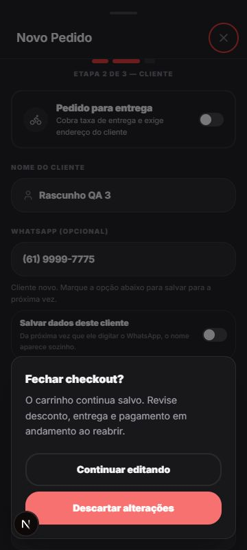

# P0 — Estabilidade de pedidos e consulta de cliente

Atualizado em 2026-09-01 após os PRs #156, #157, #158 e #159.

## Resultado executivo

O PR #156 foi integrado em `main` antes desta revisão (commit de merge
`2a2673d`). A produção do frontend está aprovada pelo deployment do commit,
e a Edge Function `get-customer-profile` está ativa na versão 14. A validação
autenticada local confirmou a estabilidade do pagamento por itens em polling e
Realtime, além dos fluxos de cliente existente, inexistente e DDD 55.

Não houve merge novo nesta etapa: o PR já estava merged. A correção de
hidratação da tela de login e o timeout da consulta encontrados durante a
validação seguem em uma alteração de acompanhamento, separada das mudanças do
PR já publicado.

## Escopo confirmado

- `/app/pedidos`: lista, polling de 15 s, Realtime, detalhe e pagamento por
  itens;
- `/app/novo-pedido`: identificação de cliente e checkout;
- `get-customer-profile`, cliente de API e normalização brasileira;
- limpeza integral dos registros criados exclusivamente para o teste.

## P0.1 — Pedido aberto não reinicia

O quadro continua a buscar pedidos por polling, Realtime e retorno à aba. A
regra em `src/lib/utils/order-refresh.ts` impede que esses caminhos
automáticos substituam o objeto do pedido aberto; a sincronização do detalhe é
reservada a uma ação explícita concluída.

### Aceite

- [x] quadro atualiza com polling de 15 segundos;
- [x] atualização Realtime em outro pedido atualiza o quadro;
- [x] pagamento por itens permanece no mesmo passo;
- [x] item marcado, total selecionado e forma de pagamento persistem;
- [x] ação explícita ainda pode pedir sincronização do detalhe.

## P0.2 — Consulta por telefone

O fluxo separa `checking`, `found`, `not_found` e `error`. A
normalização preserva o DDD 55 para número nacional e converte formatos
internacionais para E.164. Falhas de invocação não são convertidas em
“cliente novo”.

### Aceite

- [x] cliente existente preenche o nome;
- [x] cliente inexistente mostra “Cliente novo”;
- [x] `(55) 99998-7654` preserva o DDD e encontra o cadastro;
- [x] função ativa no projeto remoto;
- [x] erro de servidor e clique em **Tentar novamente** validados no navegador:
  a pausa controlada da função local alcançou o erro após 8 s, e a retentativa
  retornou “Cliente novo” depois de reativar a função.
- [x] timeout de consulta coberto por teste unitário: a chamada é abortada no
  prazo e conserva as falhas originais quando não houve expiração.

## Validação executada

| Verificação | Resultado |
|---|---|
| Checks do PR #156 | Vercel Preview e deployment aprovados; nenhum comentário humano nem conflito pendente |
| Estado do PR | `MERGED` em 2026-09-01, commit `2a2673d` |
| Frontend | deployment Production do commit de merge com status `success` |
| Edge Function | `get-customer-profile` ACTIVE, versão 14, JWT habilitado |
| Testes Vitest | 74 testes em 7 arquivos aprovados |
| ESLint | aprovado |
| Build Next.js 16.3.1 | aprovado, TypeScript e 23 rotas |
| Quadro de pedidos | aprovado com dois pedidos sintéticos locais |
| Polling + Realtime | aprovado; estado do pagamento por itens preservado |
| Cliente existente / inexistente / DDD 55 | aprovado |
| Dados sintéticos | removidos; consulta final retornou zero pedidos, clientes, perfil e usuário de teste |

## Correções complementares

Em `src/app/login/page.tsx`, a disponibilidade de passkey era calculada na
inicialização do estado. Como ela só existe no navegador, o HTML do servidor e
do cliente podiam divergir e provocar erro de hidratação. A correção inicia o
estado como `false` e verifica a capacidade em `useEffect`.

Em `src/lib/api/pdv-api.ts`, a consulta autenticada de cliente agora usa
`AbortController` com limite de 8 segundos. Ao exceder o prazo, retorna uma
mensagem de retentativa em vez de manter o checkout em “procurando”.

### P0.3 — checkout seguro em tela pequena

O primeiro incremento aprovado do estudo mobile-first eleva sheets e diálogos
acima da navegação fixa, considera `safe-area`, viewport visual e teclado para
manter a ação de rodapé acessível e centraliza o campo que recebeu foco. Também
passa a pedir confirmação antes de fechar a personalização de um produto ou um
checkout alterado. Escolher **Continuar editando** conserva o rascunho; escolher
**Descartar alterações** fecha somente a superfície — o carrinho persistente
não é removido.

### Aceite validado

- [x] em 360 px o sheet fica acima de cabeçalho, navegação e carrinho fixos;
- [x] a confirmação de descarte é legível e os dois botões têm pelo menos 48 px
  de altura;
- [x] continuar editando preserva o nome digitado no checkout;
- [x] descartar fecha o checkout sem apagar os itens do carrinho;
- [x] nenhuma regra de preço, pagamento, banco ou impressão foi alterada.

### P0.4 — regressão do pagamento por itens

O rascunho local de pagamento por itens agora só é reinicializado ao abrir um
pedido diferente. Uma nova referência de itens do mesmo pedido — vinda de
polling, Realtime ou atualização explícita — não apaga item selecionado, valor,
etapa, forma de pagamento nem mensagem em andamento.

### Aceite validado

- [x] regra pura cobre polling/Realtime do mesmo pedido e troca de pedido;
- [x] `PayItemsModal` usa a regra antes de limpar seu estado local;
- [x] o refresh automático do quadro permanece protegido por
  `getSelectedOrderSyncCandidate`.

## Limitações e achados

1. **Timeout homologado.** A indisponibilidade revelou que a interface ficava
   indefinidamente em `checking`. O PR #157 adicionou abort em 8 s; em 360 px
   a interface exibiu erro e **Tentar novamente**, e a retentativa retornou o
   estado de cliente novo após reativar a função.
2. **Configuração local insegura por padrão.** `.env.local` aponta para o
   projeto remoto; iniciar `npm run dev` sem sobrescrever as variáveis públicas
   pode testar contra dados remotos. A validação usou apenas Supabase local e
   variáveis temporárias de processo, já removidas.
3. **Janela operacional.** “Hoje” no quadro considera a virada de dia
   operacional às 03:00 (America/São_Paulo); pedidos criados antes disso não
   aparecem na consulta do dia seguinte, como esperado.
4. **Pagamento por itens mais verificável.** O P1 inicial agora mostra lote,
   valor e método no cabeçalho persistente e no CTA. A mudança é apenas de
   clareza visual; os cálculos e a chamada de pagamento permanecem os mesmos.

## Arquivos do P0

| Arquivo | Papel |
|---|---|
| `src/app/app/pedidos/page.tsx` | atualização do quadro sem substituir detalhe aberto |
| `src/lib/utils/order-refresh.ts` | decisão pura de sincronização |
| `src/app/app/pedidos/components/PayItemsModal.tsx` | pagamento por itens |
| `src/components/checkout/OrderSummarySheet.tsx` | estados da consulta de cliente |
| `src/lib/api/pdv-api.ts` | propagação de erro da função |
| `src/lib/utils/phone.ts` | normalização e máscara |
| `supabase/functions/get-customer-profile/index.ts` | resposta e lookup de perfil |
| `src/components/ui/BottomSheet.tsx` e `src/components/ui/Sheet.tsx` | viewport visual, safe area e empilhamento dos sheets |
| `src/components/feedback/DiscardChangesDialog.tsx` | confirmação reutilizável de descarte |
| `src/app/app/novo-pedido/page.tsx` | proteção da personalização de item |
| `src/components/checkout/OrderSummarySheet.tsx` | proteção do rascunho do checkout |

O estudo de usabilidade e plano sem implementação visual estão em
`docs/estudo-mobile-first-pedidos-e-consulta-cliente.md`.

## Evidência visual

